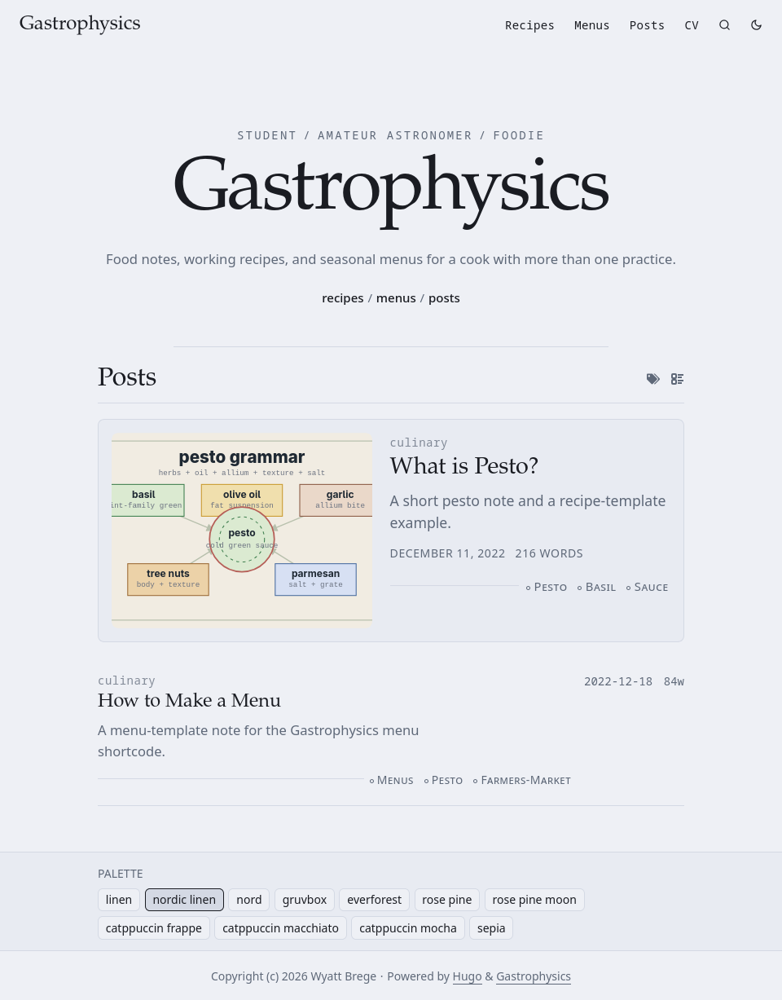
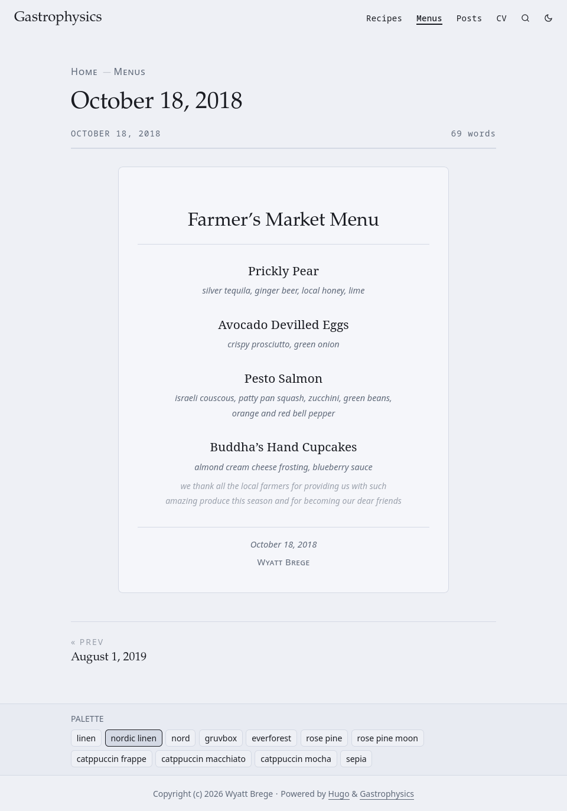
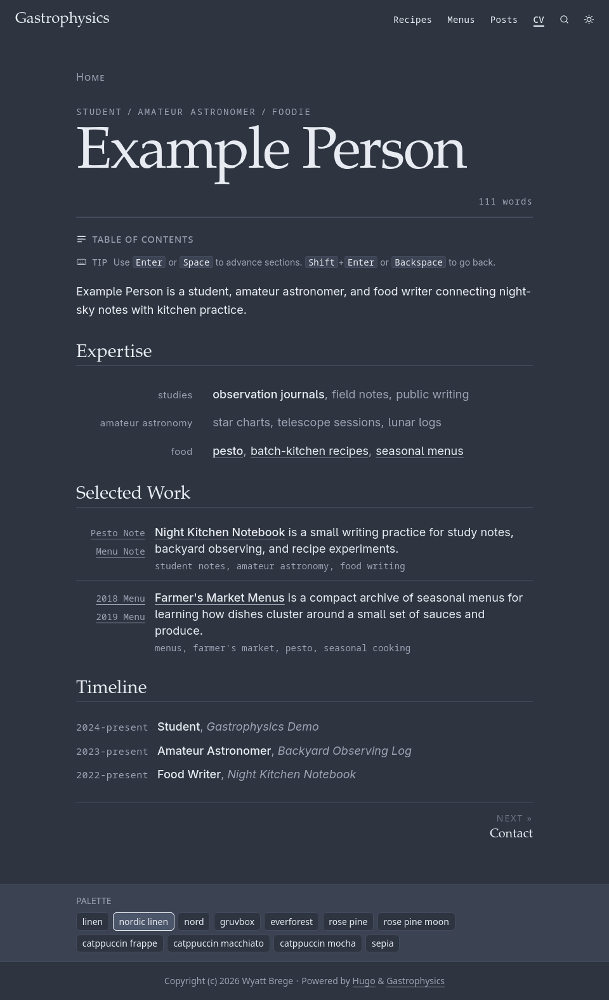

<h1 align="center">Gastrophysics | <a href="https://gastrophysics.brege.org"><b>Demo</b></a></h1>

A Hugo theme for people with split careers. It is print- and e-reader-friendly, with first-class support for sectional CVs, recipes, and tasting menus.

---

Gastrophysics started as a fork of [PaperMod](https://github.com/adityatelange/hugo-PaperMod/) for better presenting multiple career trajectories. It then moved toward a slightly textbook-y portfolio flair mixed with the editorial signatures of [The Atlantic](https://www.theatlantic.com/).

Interested in Markdown reuse? See [Related Projects](#related-projects).

## Gallery

<table>
  <tr>
    <td colspan="2">
      
      <br><strong>Example Home</strong>
      <br>Header navigation, cover-led post card, tags, and palette picker.
    </td>
  </tr>
  <tr>
    <td>
      
      <br><strong>Menu Layout</strong>
      <br>Dated farmer's market menu with the centered menu-card treatment.
    </td>
    <td>
      
      <br><strong>CV Layout</strong>
      <br>CV page rendered from <code>cv.yaml</code> with TOC and keyboard navigation.
    </td>
  </tr>
</table>

## Features

- Light/dark mode with automatic system detection
- 11 [color palettes](#color-palettes)
- Palette-aware syntax highlighting
- Sectional CV layout driven by `cv.yaml`
- Recipe and tasting-menu shortcodes with archive views
- Balanced text wrapping for navigation and footer sequences
- Anchored headings with configurable depth
- Compact and expanded post card layouts
- Centralized SVG icon registry
- Search, RSS, Open Graph, Twitter Cards, and JSON-LD

## Color Palettes

You can mix and match palettes in `hugo.toml`:

```toml
[params]
  colorLight = 'linen'
  colorDark = 'nord'
```

- linen (my custom palette)
- [rose-pine](https://github.com/rose-pine/rose-pine-theme)
- [rose-pine-moon](https://github.com/rose-pine/rose-pine-theme)
- [catppuccin-frappe](https://github.com/catppuccin/catppuccin)
- [catppuccin-macchiato](https://github.com/catppuccin/catppuccin)
- [catppuccin-mocha](https://github.com/catppuccin/catppuccin)
- [nord](https://github.com/nordtheme/nord)
- [gruvbox](https://github.com/morhetz/gruvbox)
- [everforest](https://github.com/sainnhe/everforest)
- nordic-linen
- sepia

Syntax highlighting is palette-aware across all palettes.

## CV Module

See [layouts/cv/README.md](layouts/cv/README.md).

## Recipe/Menu Module

- `recipe`: renders structured recipe markup
- `recipe-list`: renders recipes from a subsection
- `menu`: renders a tasting menu card and pulls the author from page or site params
- `menu-list`: renders a menu archive with optional H3 preview extraction

## Related Projects

1. [**oshea**](https://github.com/brege/oshea) for a Node.js plugin framework for Markdown-to-PDF pipelines.
2. [**ghrm**](https://github.com/brege/ghrm) for local GitHub README rendering with admonitions, header anchors, Mermaid diagrams, math, and many more embeddings, based on [Hugo](https://github.com/gohugoio/hugo) with a [Neovim](https://neovim.io/) [plugin](https://github.com/brege/ghrm/blob/main/lua/ghrm/init.lua).

## License

[MIT](LICENSE)
